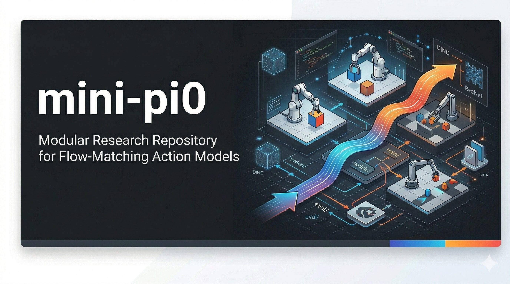
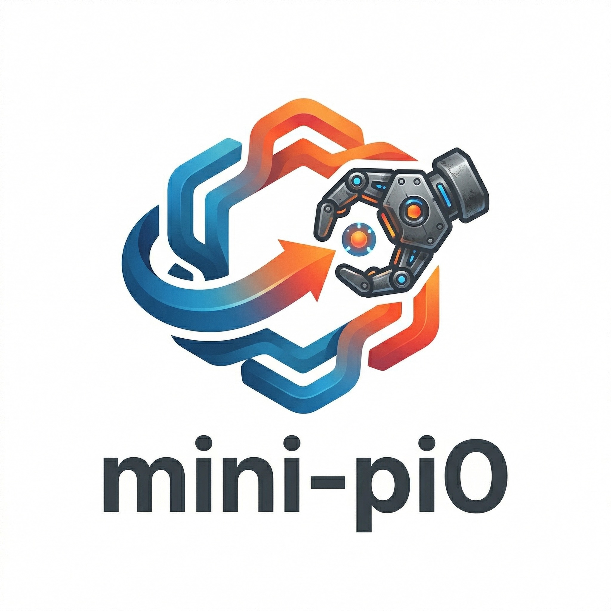
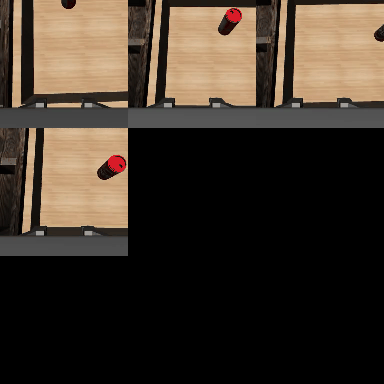

# mini-pi0

`mini-pi0` is a modular research and development codebase for training and evaluating flow-matching robot action policies from demonstrations.

## Demo



It includes:
- unified CLI for train / eval / deploy-sim / vision precompute
- typed YAML config system with CLI overrides
- modular simulator adapters (Robosuite runtime, ManiSkill3 custom-task runtime, IsaacLab scaffold)
- native `robomimic_hdf5` and `lerobot_hf` dataset loading
- image and precomputed-vision conditioning pipelines
- model registry with `mini_pi0_fm` and `mini_pi0_crossflow` (DiT-style cross-attention policy)

## Current Backend Status

- Robosuite: full runtime support
- ManiSkill3: implemented (custom multi-object pick-and-place task + collector)
- IsaacLab: scaffolded

Check local backend diagnostics:

```bash
.venv/bin/python -m mini_pi0 backends
```

## Repository Layout

```text
mini_pi0/
  cli/         # unified CLI entrypoints
  config/      # typed dataclass schema + YAML load/merge
  sim/         # simulator adapter API + backend implementations
  dataset/     # dataset readers, episode loader, torch dataset, stats
  models/      # model registry + flow matching policy
  vision/      # vision backbones + feature precompute
  train/       # training runner
  eval/        # evaluation loop, metrics, plots, grids
  deploy/      # simulation deployment loop
  utils/       # run directory and device helpers

examples/configs/
  robosuite_can_vision.yaml
  robosuite_can_crossflow.yaml
  robosuite_lift.yaml
  robosuite_lift_lerobot.yaml
  robosuite_lift_robomimic.yaml
  maniskill3_pickcube.yaml      # baseline maniskill config
  maniskill3_multiobject_tray.yaml
  isaaclab_scaffold.yaml        # scaffold
```

## Setup

```bash
# 1) create venv
uv venv --python 3.13 .venv
source .venv/bin/activate

# 2) install dependencies
uv sync --extra dev --extra lerobot --extra vision --extra hardware
```

If your environment blocks writes to the default uv cache or managed-Python path,
use this fallback (verified in this repo):

```bash
UV_CACHE_DIR=.uv-cache uv venv --no-managed-python --python "$(command -v python3.11)" .venv
source .venv/bin/activate
UV_CACHE_DIR=.uv-cache uv sync --no-managed-python --python "$(command -v python3.11)" \
  --extra dev --extra lerobot --extra vision --extra hardware
```

If you prefer pip-style install:

```bash
uv pip install -r requirements.txt
```

## Datasets

Supported formats:
- `robomimic_hdf5`
- `lerobot_hf`

Detailed guide:
- [docs/DATASETS.md](docs/DATASETS.md)
- [docs/ROBOT_DATASET_MAPPING.md](docs/ROBOT_DATASET_MAPPING.md)
- [docs/SIMULATION.md](docs/SIMULATION.md)

Download robomimic example:

```bash
.venv/bin/python -m mini_pi0 download-robomimic \
  --task can \
  --dataset_type ph \
  --hdf5_type low_dim \
  --download_dir data/robomimic
```

Download directly from Hugging Face dataset repos:

```bash
# LeRobot dataset snapshot (uses local HF cache + saves under data/lerobot)
.venv/bin/hf download robotgeneralist/robosuite_can_ph \
  --repo-type dataset \
  --local-dir data/lerobot/robosuite_can_ph

# Single robomimic file from HF
.venv/bin/hf download robomimic/robomimic_datasets \
  --repo-type dataset \
  v1.5/can/ph/low_dim_v15.hdf5 \
  --local-dir data/robomimic/can/ph
```

## Dataset Essentials

Use these fields in your config for reliable loading:
- `data.format`: `robomimic_hdf5` or `lerobot_hf`
- `robot.image_key`: visual observation key used by policy conditioning
- `robot.image_keys`: optional ordered list of visual keys for multi-camera conditioning
- `robot.state_keys`: state vector keys used by all model paths (train/eval/deploy)
- `data.lerobot_action_key` and `data.lerobot_episode_index_key` for `lerobot_hf`

Recommended key setup for Robosuite can (`robotgeneralist/robosuite_can_ph`):
- `robot.image_key='observation.images.right_wrist_0_rgb'`
- `robot.image_keys=['observation.images.right_wrist_0_rgb']`
- `robot.state_keys=['observation.state.eef_pos','observation.state.eef_quat','observation.state.tool','observation.state.object']`

Notes:
- If `robot.state_keys` is missing, pipeline falls back to `robot.proprio_keys`.
- If `robot.image_keys` is set, it overrides `robot.image_key` and preserves key order.
- In `obs_mode=image`, multiple cameras are fused side-by-side (same channels, wider image).
- In `obs_mode=feature`, per-camera features are concatenated, so feature dim scales by camera count.
- Changing `image_key` / `image_keys` / `state_keys` changes model inputs, so old checkpoints become incompatible.
- On macOS, prefer `data.lerobot_video_backend='pyav'`.
- In precomputed mode, `data.precomputed_features_path` should point to the feature directory or archive produced by `precompute-vision`.

Expected source schema:
- `robomimic_hdf5`: `/<data_group>/<demo_k>/actions` and `/<data_group>/<demo_k>/obs/...`
- `lerobot_hf`: flattened feature keys such as `observation.images.*`, `observation.state.*`, `action`, `episode_index`

## CrossFlow Policy (New)

`mini_pi0_crossflow` is the newer policy path in this repo for image-conditioned flow-matching:
- DiT-style alternating **self-attention + cross-attention** denoiser blocks.
- Multi-token vision context (spatial grid tokens) instead of a single pooled token.
- Optional timestep-conditioned AdaLN modulation in denoiser blocks.
- Better macOS MPS robustness for image tokenization path.

Key model fields:
- `model.name='mini_pi0_crossflow'`
- `model.vision_token_grid_size` (default `4`)
- `model.use_dit_adaln` (default `true`)

Reference config:
- `examples/configs/robosuite_can_crossflow.yaml`

### CrossFlow Train (Recommended)

```bash
.venv/bin/python -u -m mini_pi0 train \
  --config examples/configs/robosuite_can_crossflow.yaml \
  --set experiment.name='robosuite-can-crossflow' \
  --set data.lerobot_repo_id='robotgeneralist/robosuite_can_ph' \
  --set train.device=auto
```

### CrossFlow Eval (Recommended)

```bash
RUN_DIR="runs/robosuite-can-crossflow/run1"

.venv/bin/python -u -m mini_pi0 eval \
  --config examples/configs/robosuite_can_crossflow.yaml \
  --set eval.checkpoint="$RUN_DIR/checkpoints/best.pt" \
  --set eval.action_stats_path="$RUN_DIR/artifacts/action_stats.json" \
  --set eval.run_dir="$RUN_DIR" \
  --set eval.verbose=true \
  --set eval.log_every_episodes=1
```

### Data Curation Filters (Train)

For small/noisy datasets, use curation before chunking:
- `--filter_min_episode_length`
- `--filter_min_action_std`
- `--filter_min_state_delta`
- `--filter_state_delta_key`
- `--filter_drop_nan / --no-filter_drop_nan`

Example:

```bash
.venv/bin/python -u -m mini_pi0 train \
  --config examples/configs/robosuite_can_crossflow.yaml \
  --filter_min_episode_length 24 \
  --filter_min_action_std 0.01 \
  --filter_min_state_delta 0.02 \
  --filter_state_delta_key 'observation.state.object' \
  --filter_drop_nan
```

The curation summary is saved in:
- `runs/<exp>/runN/metrics/train_summary.json` under `data_curation`.

### Warmup Stability Controls (Eval / Deploy)

Use conservative rollout controls for the first N env steps, then switch to base values:
- `stability_warmup_steps`
- `stability_warmup_execute_steps`
- `stability_warmup_n_flow_steps`
- `stability_warmup_action_smoothing_alpha`

CLI flags:
- Eval: `--stability_warmup_steps`, `--stability_warmup_execute_steps`, `--stability_warmup_n_flow_steps`, `--stability_warmup_action_smoothing_alpha`
- Deploy-sim: same flags

Example eval:

```bash
.venv/bin/python -u -m mini_pi0 eval \
  --config examples/configs/robosuite_can_crossflow.yaml \
  --set eval.checkpoint='runs/robosuite-can-crossflow/run1/checkpoints/best.pt' \
  --set eval.action_stats_path='runs/robosuite-can-crossflow/run1/artifacts/action_stats.json' \
  --stability_warmup_steps 40 \
  --stability_warmup_execute_steps 2 \
  --stability_warmup_n_flow_steps 15 \
  --stability_warmup_action_smoothing_alpha 0.2
```

## Quickstart (Can Task, Wrist Camera, Vision Features)

This is the recommended path for your current setup.

1) Precompute wrist-camera vision features:

```bash
.venv/bin/python -u -m mini_pi0 precompute-vision \
  --config examples/configs/robosuite_can_vision.yaml \
  --set data.format=lerobot_hf \
  --set data.lerobot_repo_id='robotgeneralist/robosuite_can_ph' \
  --set data.lerobot_video_backend='pyav' \
  --set robot.image_key='observation.images.right_wrist_0_rgb' \
  --set robot.image_keys="['observation.images.right_wrist_0_rgb']" \
  --set robot.state_keys="['observation.state.eef_pos','observation.state.eef_quat','observation.state.tool']" \
  --vision_backend timm \
  --vision_model_name 'vit_base_patch16_dinov3.lvd1689m' \
  --vision_pretrained \
  --precomputed_features_path data/features/can_wrist_dinov3_vitb16
```

2) Train policy on precomputed features:

```bash
.venv/bin/python -u -m mini_pi0 train \
  --config examples/configs/robosuite_can_vision.yaml \
  --observation_mode precomputed \
  --precomputed_features_path data/features/can_wrist_dinov3_vitb16 \
  --set model.obs_mode=feature \
  --set train.val_ratio=0.1 \
  --set train.ema_decay=0.999 \
  --set train.checkpoint_use_ema=true \
  --set train.device=auto
```

2b) Resume training from a previous run checkpoint:

```bash
.venv/bin/python -u -m mini_pi0 train \
  --config examples/configs/robosuite_can_vision.yaml \
  --observation_mode precomputed \
  --precomputed_features_path data/features/can_wrist_dinov3_vitb16 \
  --resume_from runs/robosuite-can-fm-vision/run1/checkpoints/best.pt \
  --resume_optimizer \
  --set model.obs_mode=feature \
  --set train.device=auto
```

3) Evaluate with verbose live logs:

```bash
.venv/bin/python -u -m mini_pi0 eval \
  --config examples/configs/robosuite_can_vision.yaml \
  --set eval.checkpoint='runs/robosuite-can-fm-vision/run1/checkpoints/best.pt' \
  --set eval.action_stats_path='runs/robosuite-can-fm-vision/run1/artifacts/action_stats.json' \
  --set eval.run_dir='runs/robosuite-can-fm-vision/run1' \
  --set model.obs_mode=feature \
  --set model.vision_dim=768 \
  --set vision.use_runtime_extractor=true \
  --set vision.model_name='vit_base_patch16_dinov3.lvd1689m' \
  --verbose --log_every_episodes 1
```

## Evaluation Guide

Minimal eval command:

```bash
.venv/bin/python -u -m mini_pi0 eval \
  --config examples/configs/robosuite_can_vision.yaml \
  --set eval.checkpoint='runs/robosuite-can-fm-vision/run1/checkpoints/best.pt' \
  --set eval.action_stats_path='runs/robosuite-can-fm-vision/run1/artifacts/action_stats.json'
```

Useful eval options:
- `--verbose --log_every_episodes 1` for per-episode progress logs
- `--strict_parity` (default) to fail fast when checkpoint/runtime config mismatches
- `--set eval.action_smoothing_alpha=0.2` to smooth actions between replans
- `--stability_warmup_steps`, `--stability_warmup_execute_steps`, `--stability_warmup_n_flow_steps`, `--stability_warmup_action_smoothing_alpha` for early-rollout stabilization
- `--set eval.action_scale='[1,1,1,1,1,1,1]'` for per-dimension action scaling
- `--set eval.record_grid=true` to save success/failure 3x3 grid videos
- `--set eval.max_steps=200` to cap rollout horizon
- `--set eval.run_dir='runs/<exp>/runN'` to write metrics into an existing run

Metric interpretation:
- `success_rate`: fraction of episodes that reached task success
- `CI95`: bootstrap 95% confidence interval over success rate
- `episode_len_mean/std`: rollout length stats in environment steps
- `reward_mean`: average accumulated reward
- `infer_ms_mean`: average model inference latency per predicted chunk

Output files:
- `metrics/eval_summary.json`: scalar metrics
- `metrics/eval_arrays.json`: per-episode raw arrays
- `metrics/eval_provenance.json`: checkpoint/runtime parity report + diff
- `metrics/eval_config_requested.yaml`: config requested by CLI before checkpoint injection
- `metrics/eval_config_runtime.yaml`: final runtime config after checkpoint model injection
- `artifacts/eval_metrics.png`: plots for success trend, episode length, reward distribution
- `artifacts/success_grid_*.mp4` and `artifacts/failure_grid_*.mp4` when grid recording is enabled

Failure diagnostics in `eval_summary.json`:
- `failure_reason_counts`: breakdown (`no_progress`, `timeout_after_progress`, `drop_or_unstable`, ...)
- `action_clip_fraction_mean`: percent of actions clipped by env bounds
- `max_step_reward_mean`: best per-step reward reached on average

## Eval Ablation Sweep

Run rollout hyperparameter sweeps without editing code:

```bash
.venv/bin/python -u -m mini_pi0 ablate-eval \
  --config examples/configs/robosuite_can_vision.yaml \
  --checkpoint runs/robosuite-can-fm-vision/run1/checkpoints/best.pt \
  --action_stats runs/robosuite-can-fm-vision/run1/artifacts/action_stats.json \
  --n_episodes 10 \
  --execute_steps_values 1,2,4 \
  --n_flow_steps_values 10,15,30 \
  --smoothing_values 0.0,0.2
```

Artifacts are saved under `runs/<experiment>-ablation/runN/` with:
- `metrics/ablation_metrics.jsonl`
- `metrics/ablation_summary.json`

## Important Config Notes

- `robot.state_keys` is the preferred definition for policy state inputs.
- If `robot.state_keys` is not set, pipeline falls back to `robot.proprio_keys`.
- If you change camera view or state keys, retrain the model for consistent behavior.

## Vision Backbone Discovery

```bash
.venv/bin/python -m mini_pi0 vision-models
.venv/bin/python -m mini_pi0 vision-models --backend timm
.venv/bin/python -m mini_pi0 vision-models --backend timm --all_timm
```

## Run Artifacts

Each run is written as ordered folders:

```text
runs/<experiment_name>/run1/
runs/<experiment_name>/run2/
...
```

Typical outputs:
- `checkpoints/best.pt`
- `artifacts/action_stats.json`
- `metrics/train_summary.json`
- `metrics/eval_summary.json`

## Hardware Deploy Helper

Hardware deploy helper remains separate:

```bash
.venv/bin/python deploy_so100.py ...
```
