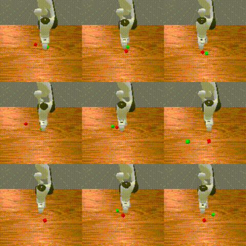
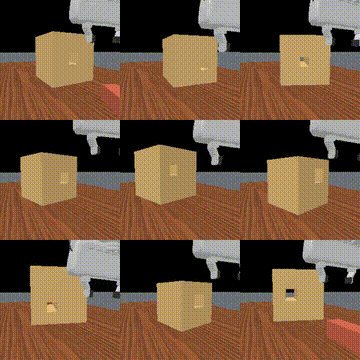
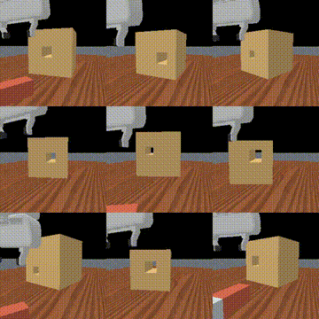
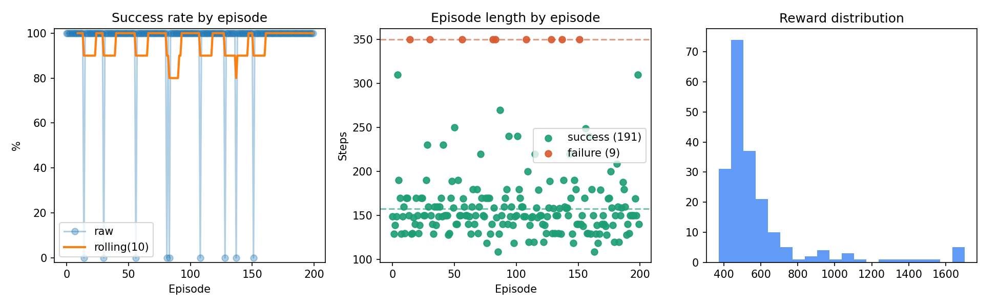
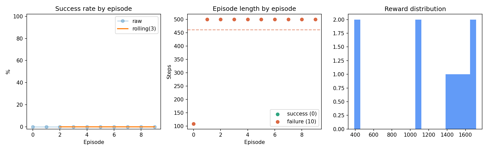

<p align="center">
  
</p>

# mini-pi0

`mini-pi0` is a compact research codebase for training flow-matching robot
action policies on ManiSkill demonstrations. The current stack centers on
`mini_pi0_fm`: an image-conditioned action-chunk policy with transformer,
CNN1D, and UNet1D denoisers.

## Demo Gallery

### StackCube Motion Planning

95.5% success over 200 eval episodes with the medium transformer + ViT policy.

[](./assets/stackcube_success_grid_3x3.mp4)

Click the preview to open the MP4.

### PegInsertionSide Diagnostics

Peg insertion is the current hard task. The model reaches and contacts the
hole, but insertion is not yet reliable. The videos below are failure grids
from the added close hole cameras, which make alignment errors visible.

| Left hole camera | Right hole camera |
| --- | --- |
| [](./assets/peginsertion_failure_grid_hole_left_camera_3x3.mp4) | [](./assets/peginsertion_failure_grid_hole_right_camera_3x3.mp4) |

Click a preview to open the MP4.

## What Is In This Repo

- ManiSkill simulation workflows for collection, replay, conversion, training,
  eval, deploy-sim, and diagnostics.
- `mini_pi0_fm` flow-matching policy with:
  - action backbones: `transformer`, `cnn1d`, `unet1d`
  - vision backbones: `resnet18`, `timm`
  - multi-camera cross-attention conditioning
  - observation history and chunked action prediction
- Robomimic-style HDF5 loading for converted ManiSkill trajectories.
- Action diagnostics for comparing flow steps and per-dimension clipping.
- PegInsertion support with close hole cameras and optional contact features.
- IsaacLab adapter scaffold kept for future integration work.

## Repository Layout

```text
mini_pi0/
  cli/         # train/eval/convert/collect command entrypoints
  config/      # typed dataclass config schema and YAML loading
  dataset/     # HDF5 episode loading, conversion, torch datasets
  sim/         # simulator adapters and custom ManiSkill environments
  models/      # mini_pi0_fm model and registry
  train/       # training loop, optimizer, checkpointing
  eval/        # rollout eval, action diagnostics, grid videos
  deploy/      # simulation deployment loop
  utils/       # runtime/device/parity helpers

examples/configs/
  maniskill3_stackcube_motionplanning_transformer_vit_hist2_medium.yaml
  maniskill3_tray_transformer_vit_hist2_chunk16.yaml
  maniskill3_peginsertion_motionplanning_transformer_vit_hist3_medium_holecam_contacts.yaml
```

## Install

```bash
python -m venv .venv
. .venv/bin/activate
pip install -e ".[maniskill3,vision,dev]"
```

If you use `uv`:

```bash
uv venv --python 3.11 .venv
. .venv/bin/activate
uv sync --extra maniskill3 --extra vision --extra dev
```

## Quickstart

Train the StackCube transformer + ViT policy:

```bash
mini-pi0 train \
  --config examples/configs/maniskill3_stackcube_motionplanning_transformer_vit_hist2_medium.yaml
```

Evaluate a checkpoint:

```bash
mini-pi0 eval \
  --config examples/configs/maniskill3_stackcube_motionplanning_transformer_vit_hist2_medium.yaml \
  --set eval.checkpoint=runs/<experiment>/run1/checkpoints/best.pt \
  --set eval.action_stats_path=runs/<experiment>/run1/artifacts/action_stats.json \
  --set eval.record_grid=true \
  --set eval.grid_cameras='["base_camera","hand_camera"]'
```

Run offline action diagnostics:

```bash
python -m mini_pi0.eval.action_diagnostics \
  --config examples/configs/maniskill3_stackcube_motionplanning_transformer_vit_hist2_medium.yaml \
  --checkpoint runs/<experiment>/run1/checkpoints/best.pt \
  --action_stats runs/<experiment>/run1/artifacts/action_stats.json \
  --flow_steps 4,6,8
```

## ManiSkill Data Workflow

Download built-in ManiSkill demonstrations:

```bash
python -m mani_skill.utils.download_demo StackCube-v1 \
  --output_dir demos/maniskill
```

Replay demonstrations with RGBD observations and the target controller:

```bash
python -m mani_skill.trajectory.replay_trajectory \
  --traj-path demos/maniskill/StackCube-v1/motionplanning/trajectory.h5 \
  --obs-mode rgbd \
  --target-control-mode pd_joint_pos \
  --save-traj
```

Convert the replayed trajectory into the training schema:

```bash
mini-pi0 convert-maniskill-trajectory \
  --input_hdf5 demos/maniskill/StackCube-v1/motionplanning/trajectory.rgbd.pd_joint_pos.physx_cpu.h5 \
  --output_hdf5 data/robomimic/maniskill/stackcube/mp/rgbd_pd_joint_pos.hdf5 \
  --overwrite
```

For full data notes, custom environment collection, and task conversion details,
see [docs/DATASETS.md](docs/DATASETS.md) and
[docs/SIMULATION.md](docs/SIMULATION.md).

## PegInsertionSide

PegInsertionSide is tracked separately because it needs better visual access to
the hole and benefits from contact diagnostics. This branch includes:

- `MiniPi0PegInsertionSide-v1`, a repo-local ManiSkill environment with close
  `hole_left_camera` and `hole_right_camera` sensors.
- Replay helpers for local env registration.
- Contact extraction into HDF5 under `obs/*` keys.
- A contact-aware config:
  `examples/configs/maniskill3_peginsertion_motionplanning_transformer_vit_hist3_medium_holecam_contacts.yaml`.

Prepare the hole-camera contact dataset:

```bash
NUM_ENVS=16 tools/prepare_peginsertion_holecam_contacts.sh
```

Train the current PegInsertion config:

```bash
mini-pi0 train \
  --config examples/configs/maniskill3_peginsertion_motionplanning_transformer_vit_hist3_medium_holecam_contacts.yaml
```

Read the task-specific notes in [docs/PEG_INSERTION.md](docs/PEG_INSERTION.md).

## Config Notes

The main knobs are:

- `model.action_backbone`: `transformer`, `cnn1d`, or `unet1d`
- `model.vision_backbone`: `resnet18` or `timm`
- `model.conditioning_mode`: `cross_attention` or `global`
- `model.obs_horizon`: number of observation frames
- `data.chunk_size` and `model.chunk_size`: predicted action horizon
- `robot.image_keys`: ordered camera observations
- `robot.state_keys`: proprio/contact state keys
- `eval.grid_cameras`: one or more cameras for saved rollout grids

When camera keys, state keys, action dimension, or chunk size change, retrain or
use a checkpoint trained with the same interface.

## Validation

Run focused checks:

```bash
python -m pytest \
  tests/test_config.py \
  tests/test_model_registry.py \
  tests/test_fm_architecture.py \
  tests/test_training_stability_controls.py \
  tests/test_eval_weight_source.py \
  -q
```

Run the full suite:

```bash
python -m pytest -q
```

## Results

### StackCube-v1

Config:
`examples/configs/maniskill3_stackcube_motionplanning_transformer_vit_hist2_medium.yaml`

Run:
`runs/maniskill3-stackcube-motionplanning-transformer-vit-hist2-medium/run1/final_eval_best_seed42`

| Metric | Value |
| --- | ---: |
| Success rate | 95.5% |
| CI95 | 92.5% - 98.0% |
| Episodes | 200 |
| Mean episode length | 166.2 steps |
| Mean reward | 586.7 |
| Mean inference speed | 31.9 ms/chunk |
| Mean action clipping | 58.4% |



Artifacts:
- [success grid](./assets/stackcube_success_grid_3x3.mp4)
- [eval metrics](./assets/stackcube_eval_metrics.png)
- Source run artifacts:
  `runs/maniskill3-stackcube-motionplanning-transformer-vit-hist2-medium/run1/final_eval_best_seed42/artifacts`

### PegInsertionSide-v1

Config:
`examples/configs/maniskill3_peginsertion_motionplanning_transformer_vit_hist3_medium_holecam_contacts.yaml`

Run:
`runs/maniskill3-peginsertion-motionplanning-transformer-vit-hist3-medium-holecam-contacts/run1/final_eval_best_seed24`

| Metric | Value |
| --- | ---: |
| Success rate | 0.0% |
| Episodes | 10 |
| Mean episode length | 460.9 steps |
| Mean reward | 1245.4 |
| Mean inference speed | 49.0 ms/chunk |
| Mean action clipping | 0.12% |
| Failure modes | 9 timeout after progress, 1 drop/unstable |



Artifacts:
- [left hole-camera failure grid](./assets/peginsertion_failure_grid_hole_left_camera_3x3.mp4)
- [right hole-camera failure grid](./assets/peginsertion_failure_grid_hole_right_camera_3x3.mp4)
- [eval metrics](./assets/peginsertion_eval_metrics.png)
- Source run artifacts:
  `runs/maniskill3-peginsertion-motionplanning-transformer-vit-hist3-medium-holecam-contacts/run1/final_eval_best_seed24/artifacts`

Current interpretation: the policy can reach the hole region and generate
contact, but insertion alignment is still the active failure point. The next
useful debugging step is task-specific phase diagnostics: grasp state, peg-hole
distance, peg-hole angular error, insertion depth, and contact/jamming signals.


## TODO

- [x] Train a stable FM transformer + ViT policy on StackCube motion-planning data.
- [x] Add PegInsertionSide close hole cameras and contact-feature conversion.
- [x] Save multi-camera eval grids with `eval.grid_cameras`.
- [ ] Add task-specific failure diagnostics for insertion and contact-rich tasks:
  grasp state, peg-hole distance, angular alignment, insertion depth, contact
  force, and jamming detection.
- [ ] Improve PegInsertionSide with better camera placement, richer contact
  conditioning, and phase-aware evaluation metrics.
- [ ] Add domain randomization presets for all ManiSkill tasks once the baseline
  imitation-learning setup is stable.
- [ ] Add LeRobot dataset support for scalable multi-task training across larger
  shared robot datasets.
- [ ] Add multi-GPU training for larger ViT backbones, more cameras, and larger
  task mixtures.
- [ ] Add RL fine-tuning after imitation learning. The immediate target is to warm
  start from `mini_pi0_fm` checkpoints, then optimize task success and contact
  robustness with environment rewards while constraining policy drift from the
  demonstration policy.
- [ ] Expand to more ManiSkill tasks and eventually reuse the same policy stack
  with the IsaacLab adapter.

## References

- [ManiSkill / haosulab](https://github.com/haosulab/ManiSkill/tree/main)
- [π0: A Vision-Language-Action Flow Model for General Robot Control](https://www.pi.website/download/pi0.pdf)
- [Diffusion Policy](https://diffusion-policy.cs.columbia.edu/#paper)
