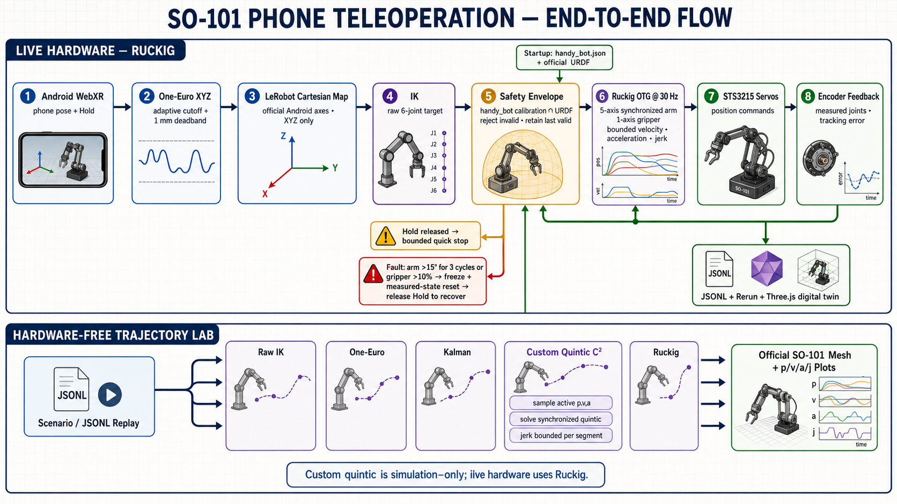

# SO-101 Android phone teleoperation



Control an SO-101 follower using Android WebXR phone motion. The application
maps the calibrated phone pose to end-effector targets, solves joint commands
through inverse kinematics, and provides:

- Android WebXR over USB with ADB port forwarding
- One-Euro XYZ filtering, a 0.25 mm radial deadband, and synchronized arm Ruckig OTG
- tracking-error fault latching with release-to-recover clutch semantics
- a localhost Three.js console using the official articulated STL model
- a hardware-free trajectory lab with raw, Kalman, quintic, and Ruckig comparisons
- optional Rerun 3D actual/commanded robot tracking and motor telemetry
- a terminal `B` shortcut for return-to-base and phone recalibration
- per-motor voltage, current, load, and temperature telemetry
- 30 Hz session logs and automatic pre-failure incident captures
- explicit cleanup warnings when the servo bus cannot receive torque-disable

## Project layout

```text
so101/phone_teleop/
├── teleoperate.py              # Phone, IK, robot control, and base return
├── control_stack.py            # One-Euro/Ruckig/profile/fault state
├── filtering.py                # One-Euro and offline Kalman filters
├── trajectory.py               # Simulation-only synchronized quintic OTG
├── calibration.py              # handy_bot calibration ranges and metadata
├── model_assets.py             # Official URDF/STL cache and validation
├── simulator.py                # Hardware-free trajectory-lab entrypoint
├── flight_recorder.py          # Electrical telemetry and incident capture
├── control_ui.py               # Thread-safe localhost desktop console
├── visualization.py            # Rerun robot/end-effector 3D view and trail
├── urdf_model.py               # Lightweight URDF forward kinematics
├── dashboard/                  # Desktop UI HTML, CSS, and JavaScript
├── kinematics/
│   └── so101_kinematics.urdf   # Self-contained kinematics model
├── tests/                      # Hardware-independent safety/logging tests
└── README.md
```

## Current robot configuration

| Setting | Value |
| --- | --- |
| Robot | SO-101 follower |
| LeRobot calibration ID | `handy_bot` |
| Servo port | `/dev/cu.usbmodem5B610338651` |
| Calibration | `~/.cache/huggingface/lerobot/calibration/robots/so_follower/handy_bot.json` |
| Base position | `~/.cache/huggingface/lerobot/base_positions/robots/so_follower/handy_bot.json` |
| Phone | Android WebXR |
| Control rate | 30 Hz |
| Phone-controlled axes | XYZ translation and gripper; roll/pitch/yaw disabled by default and selectable in the console |
| Translation mapping | LeRobot Android default |
| Translation gain | `0.5` per axis |
| Cartesian step limit | `0.10 m` per control cycle |
| Joint target validation | calibrated servo range ∩ official URDF range |
| Gripper speed factor | `20.0` |
| STS3215 acceleration | LeRobot default (`254`) |
| Safe arm OTG limits | `[30,30,30,45,60]°/s`, `[90,90,90,135,180]°/s²`, `[450,450,450,675,900]°/s³` |
| Smooth arm OTG limits | `[20,20,20,30,40]°/s`, `[60,60,60,90,120]°/s²`, `[180,180,180,270,360]°/s³` |
| Safe gripper OTG limits | `25%/s`, `75%/s²`, `375%/s³` |
| Smooth gripper OTG limits | `15%/s`, `45%/s²`, `180%/s³` |
| Live One-Euro defaults | `1.0 Hz` minimum cutoff, `beta=2.0`, `1.0 Hz` derivative cutoff, `0.25 mm` deadband |
| Desktop console | `http://127.0.0.1:8001` |
| LeRobot version | `0.6.1` |

The translation mapping and motion values reproduce the LeRobot phone example.
No custom X/Y remap is applied. Orientation defaults to off (XYZ-only) and can
be enabled from the desktop console while Hold is released.

The calibration pose defines the phone-to-robot translation frame. Lay the
phone flat with its screen facing up and point its top edge straight forward,
away from the robot base, before touching **Hold to move** to capture the pose.
With that reference, moving the phone forward/back controls robot X,
left/right controls robot Y, and lifting/lowering it controls robot Z.

The motor calibration file contributes motor IDs, homing offsets, raw STS3215
range endpoints, and the exact LeRobot normalized range. It does not replace
the CAD limits: live commands use the intersection of calibrated travel and
the official URDF range. The current saved base pose places `shoulder_lift`
and `elbow_flex` slightly outside that intersection, so the launcher prints a
warning. Re-capture the base pose inside the envelope before unloaded testing.

## Installation

Use the repository's existing `.venv` and install the pinned phone, Rerun, and
desktop-console dependencies:

```bash
.venv/bin/python -m pip install -r so101/phone_teleop/requirements.txt
```

### Install ADB

ADB is provided by the Android SDK Platform Tools. Use the installation method
for the host operating system.

#### macOS

```bash
brew install --cask android-platform-tools
```

#### Ubuntu or Debian

```bash
sudo apt update
sudo apt install adb android-sdk-platform-tools-common
```

The `android-sdk-platform-tools-common` package installs common Android `udev`
rules. If `adb devices` reports insufficient permissions, add the current user
to `plugdev`, then log out and back in:

```bash
sudo usermod -aG plugdev "$LOGNAME"
```

#### Fedora

```bash
sudo dnf install android-tools
```

#### Arch Linux

```bash
sudo pacman -S android-tools android-udev
```

`android-udev` provides additional device rules and is useful when the phone is
not detected as a regular user.

For other Linux distributions, install the latest standalone Linux archive
from the [official Android SDK Platform Tools page](https://developer.android.com/tools/releases/platform-tools),
extract it, and add its `platform-tools` directory to `PATH`.

On Android, enable Developer options and USB debugging, connect the phone by
USB, unlock it, and accept the computer authorization prompt.

### Linux servo-port setup

The configured `/dev/cu.usbmodem5B610338651` servo path is specific to macOS.
On Linux, connect the Waveshare servo adapter and find its device:

```bash
ls -l /dev/ttyACM* /dev/ttyUSB* 2>/dev/null
```

It commonly appears as `/dev/ttyACM0` or `/dev/ttyUSB0`. Update the `port`
value in `so101/phone_teleop/teleoperate.py` before launching.

If opening the servo port returns `Permission denied`, add the current user to
the serial-device group and then log out and back in:

```bash
sudo usermod -aG dialout "$USER"
```

Confirm access after signing in again:

```bash
id
ls -l /dev/ttyACM0
```

## Before every run

1. Support the arm and clear its workspace.
2. Confirm the motor model and use the matching externally powered servo
   supply. Do not power the servos from USB alone.
3. Close the joint UI or any other process using the servo port.
4. Confirm the Android device is authorized:

   ```bash
   adb devices
   ```

5. Forward the WebXR HTTPS/WebSocket port over USB:

   ```bash
   adb reverse tcp:4443 tcp:4443
   ```

## Start teleoperation

From the repository root, run:

```bash
.venv/bin/python -m so101.phone_teleop.teleoperate
```

The launcher always starts in **Safe**. Select **Smooth** in the desktop console
while Hold is released for the conservative tuning above. The launcher starts
the phone server before opening the servo bus. On Android:

1. Open `https://127.0.0.1:4443` in Chrome.
2. Accept the local certificate warning if shown.
3. Hold the phone screen-up with its top edge pointing in the robot's forward
   direction.
4. Touch and move on the WebXR page when the terminal asks for calibration.
5. Release **Hold to move** before the robot connects.
6. Wait for `Starting teleop loop` before commanding motion.

The desktop console opens automatically at <http://127.0.0.1:8001>. It is
available during phone calibration and throughout teleoperation. Rerun is off
by default; enable it when needed with:

```bash
.venv/bin/python -m so101.phone_teleop.teleoperate --rerun
```

If the browser does not open, visit the desktop-console address manually.

Phone translation controls the end-effector while roll, pitch, and yaw deltas
are zeroed. The end-effector keeps the orientation captured when **Hold to
move** establishes the latched phone and robot references. Use **Enable phone
orientation** in the console to change this behavior while Hold is released.
A and B open and close the gripper independently of the arm Hold clutch. The
LeRobot gripper position target bypasses Ruckig and is sent directly to the
servo while a button is pressed. Releasing both buttons retains the last
commanded gripper position.

## Start the hardware-free trajectory lab

Populate or repair the official SO-101 model cache and launch the simulator:

```bash
.venv/bin/python -m so101.phone_teleop.simulator
```

The first launch synchronizes `hf://buckets/lerobot/robot-urdfs/so101` into
`~/.cache/huggingface/lerobot/robot-urdfs/so101`. A completion marker is written
only after `so101_new_calib.urdf` and all 13 referenced STL files validate.
Subsequent launches are offline-capable; Three.js, OrbitControls, STLLoader,
and URDFLoader are pinned and bundled in `dashboard/vendor/`.

The lab has four synthetic experiments plus JSONL replay. It animates measured
motion as a solid robot and the selected command as a translucent ghost, and
plots position, velocity, acceleration, jerk, phone XYZ, current, voltage, and
tracking error. It contains no robot, motor-bus, serial-port, or phone object.

## Phone controls

| Control | Behavior |
| --- | --- |
| **Hold to move** | Enables phone-pose control while held. Releasing it holds the last end-effector command. |
| **Scale** | Scales phone motion. Keep it at or below `0.25` while power and motion limits are being validated. |
| Phone **A** | Commands positive gripper velocity (opens the configured gripper). |
| Phone **B** | Commands negative gripper velocity (closes the configured gripper). |
| Gripper engage/disengage | Enables or disables gripper interaction in the WebXR interface. |

The phone's **B** button controls the gripper. It is different from pressing
`B` in the terminal.

## Desktop control console

The console runs in a background web-server thread and never talks to the
servo bus directly. The 30 Hz teleoperation thread remains the only owner of
the serial connection and the phone processor.

It provides:

- an orbit/pan/zoom renderer using the official visual URDF and 13 STL assets
- solid measured geometry and an optional translucent commanded ghost
- actual/commanded joint position and live voltage, current, load, and
  temperature for every servo
- loop time, Cartesian tracking error, minimum bus voltage, and summed current
- active filter, OTG, profile, clutch, warning, and fault state
- Smooth/Safe/Balanced/Responsive profile selection while Hold is released;
  Responsive uses a `2.5×` commissioning-limit multiplier
- bounded live One-Euro filter settings while Hold is released
- live phone-orientation enable/disable while Hold is released
- **Return to base + recalibrate**, equivalent to terminal `B`

There are no live joint sliders. Settings requests receive HTTP `409` while
Hold is active and every hardware launch begins in Safe.

## Return to base and recalibrate

Focus the launching terminal and press `B`; Enter is not required. One keypress
runs the complete reset sequence:

1. Phone motion is ignored while all six joints return to the saved base pose.
2. Release **Hold to move**.
3. The phone calibration prompt restarts automatically.
4. Hold the phone in the new screen-up/forward reference pose and press **Hold
   to move** once to capture it.
5. Release **Hold to move** once more.
6. The next press starts motion from a fresh IK reference at base.

Base return preserves its separate 40°/s arm-joint command trajectory and a 25%/s gripper
trajectory. Completion tolerances are 2° for arm joints and 3% for the gripper.
A 15° following-error limit stops a blocked base return.

Before exiting, use terminal `B` to return to base. Then press `Ctrl+C`. If the
bus has already failed, software may be unable to disable torque; switch off
motor power before touching the arm.

## 3D visualization and flight-recorder logs

With `--rerun`, Rerun opens with a synchronized 3D robot and end-effector view:

- green/orange link skeletons: measured and commanded URDF poses
- green marker and trail: measured end-effector position from forward kinematics
- RGB arrows: measured end-effector orientation axes
- orange marker: commanded end-effector position
- red line: Cartesian difference between measured and commanded positions
- plots: actual/target XYZ and Cartesian error in millimeters

The measured 3D pose is a forward-kinematics estimate derived from the joint
encoders. It does not measure structural flex, gripper deflection, backlash, or
external displacement with a camera.

The same Rerun session displays phone/action values and these per-motor signals:

- voltage in volts
- estimated current in milliamps
- load in percent
- temperature in °C

Every run writes:

```text
logs/phone_teleop/session_<timestamp>.jsonl
```

The session log contains measured positions, requested raw IK commands, commands
sent to the robot, actual/target Cartesian positions, Cartesian error, phone
state, raw/filtered/deadband XYZ, estimated velocity and cutoff, Ruckig
position/velocity/acceleration/jerk, profile constraints, OTG result, clutch,
tracking warning/fault state, control-loop timing, and electrical readings at 30 Hz.
When the arm and quick-stop OTG are stationary, voltage and current are sampled
from the servo bus at up to 5 Hz and load and temperature at up to 1 Hz. During
active Hold and quick stopping, the logger repeats the last cached electrical
sample instead of blocking the 30 Hz command loop.

When an exception occurs, the final approximately 20 seconds are copied into:

```text
logs/phone_teleop/incident_<timestamp>_<number>.json
```

The incident includes the exact control phase, exception, traceback, requested
and sent commands, joint and Cartesian positions, phone inputs, and last valid
electrical samples. A second incident is written when torque-disable also fails
during shutdown.

The terminal prints the generated paths and a once-per-second summary:

```text
TELEMETRY Vmin=5.2V Itotal=850mA Ipeak=elbow_flex:320mA Tmax=36C
```

The servo telemetry cannot measure the minimum of a sub-200 ms voltage
transient after the bus stops responding. Use an oscilloscope or power analyzer
for the true rail minimum.

## LeRobot control mapping and safe use

The live control order is:

1. `OneEuroXYZFilter` filters calibrated `phone.pos` from monotonic timestamps
   with the live `1.0 Hz`, `beta=2.0` defaults and applies a 0.25 mm radial
   deadband. This keeps the output continuous enough for online retargeting
   without passing the full static phone noise.
2. `MapPhoneActionToRobotAction` applies the official Android axis map.
3. When phone orientation is disabled, one stateless filter zeros only
   `target_wx`, `target_wy`, and `target_wz`.
4. `EEReferenceAndDelta`, `EEBoundsAndSafety`, `GripperVelocityToJoint`, and
   `InverseKinematicsEEToJoints` preserve LeRobot's gain, step, and gripper values.
5. Non-finite or out-of-envelope arm IK targets are rejected while the last
   valid arm target is retained.
6. A bounded, low-pass joint-target velocity is estimated from successive valid
   IK targets. Five-axis synchronized arm Ruckig receives the moving target
   state and propagates its commanded state every 30 Hz cycle.
7. The gripper bypasses trajectory generation: A/B update its direct position
   command and button release holds the last command.

On Hold release, the OTG is immediately retargeted to a bounded stopping point.
An arm following error over 10° warns; over 15° for three cycles faults. A fault
resets arm OTG from measured state and remains paused until Hold is released.
Gripper following error remains visible in telemetry but does not pause or
retrigger the direct button command.

## How the educational quintic retargeter works

`trajectory.py` is deliberately readable and simulation-only. For each joint,
`QuinticSegment.from_boundary_conditions` solves the final three coefficients
of `p(t) = c0 + c1 t + … + c5 t⁵` after setting `c0`, `c1`, and `c2` directly
from the current position, velocity, and acceleration. The endpoint is the
requested position with zero velocity and acceleration.

`synchronized_quintic` estimates a duration from velocity, acceleration, and
jerk limits, analytically checks derivative extrema, enlarges any infeasible
duration, and rebuilds every joint using the longest duration. Therefore all
joints arrive together. `OnlineQuinticRetargeter.retarget` first samples the
active segment, then uses that exact position, velocity, and acceleration as
the new initial boundary. Segment boundaries are C² continuous. Jerk is bounded
inside a segment but may change discontinuously at a retarget; this is one key
difference from Ruckig's jerk-limited online algorithm.

The phone should still be used as a clutch: hold **Move**, make a small motion,
release it, reposition the phone, and engage it again. Keep phone **Scale** at
`0.25` or below until voltage and following behavior are validated.

Previous flight-recorder analysis identified single-frame target changes above
20°, following errors above 40°, and a servo-rail drop from approximately
5.2 V to 4.5 V before all six motors stopped replying. Because the restored
mapping is more responsive, use it cautiously and validate the power path:

- keep phone **Scale** at `0.25` or below
- move slowly and avoid sudden direction reversals
- do not test with an undersized or mismatched supply
- keep the hardware power switch reachable
- stop testing after any whole-bus communication dropout

Repeated `There is no status packet` errors for all IDs indicate a bus-wide
power or communication loss, not an individual IK failure. After such an error,
do not assume the shutdown torque-disable command succeeded.

The Waveshare Bus Servo Adapter (A) passes the input motor voltage through
without regulation and is specified for a maximum of 5 A. Use a correctly
rated external servo supply and keep the power path short. Do not disable the
servo's voltage or current protection. See the
[Waveshare adapter FAQ](https://docs.waveshare.com/Bus_Servo_Adapter_A/FAQ),
[LeRobot phone example](https://github.com/huggingface/lerobot/blob/main/examples/phone_to_so100/teleoperate.py),
and [SO follower configuration](https://github.com/huggingface/lerobot/blob/main/src/lerobot/robots/so_follower/config_so_follower.py).

## Troubleshooting

### Phone page does not open

Verify the USB device and forwarding rule:

```bash
adb devices
adb reverse --list
```

The list should include `tcp:4443 tcp:4443`. Refresh
`https://127.0.0.1:4443` after the Python server starts.

On Linux, if `adb devices` reports `no permissions`, confirm that the user is in
`plugdev`, install the distribution's Android `udev` rules, reconnect the phone,
and restart ADB:

```bash
adb kill-server
adb start-server
adb devices
```

### Servo port is busy

Find the process that owns it:

```bash
lsof /dev/cu.usbmodem5B610338651
```

Stop the previous teleoperation or joint-UI process before starting another.

### All motors report no status packet

Check, in order:

1. External servo power and its voltage/current rating.
2. Driver-board power switch and DC connector.
3. The first servo cable and all daisy-chain connectors.
4. Whether rapid commands caused a voltage drop in the latest incident file.
5. Whether another process attempted to use the bus.

Do not solve a bus-wide power dropout by only increasing serial retry counts.

## Tests

The filter, trajectories, Ruckig, replay, simulator API, calibration, model,
recorder, desktop API, URDF, and Cartesian tests do not
require hardware:

```bash
.venv/bin/python -m pytest -q so101/phone_teleop/tests
```
